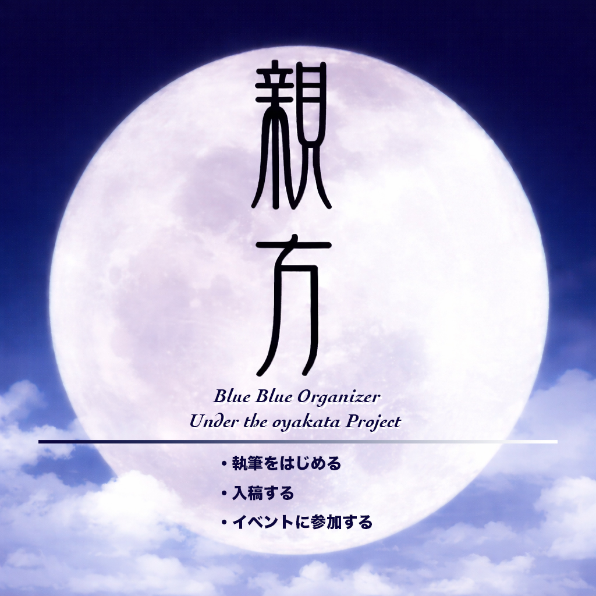
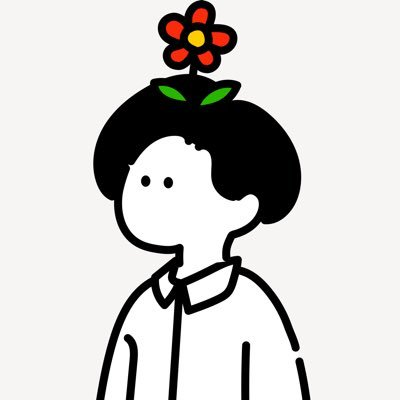
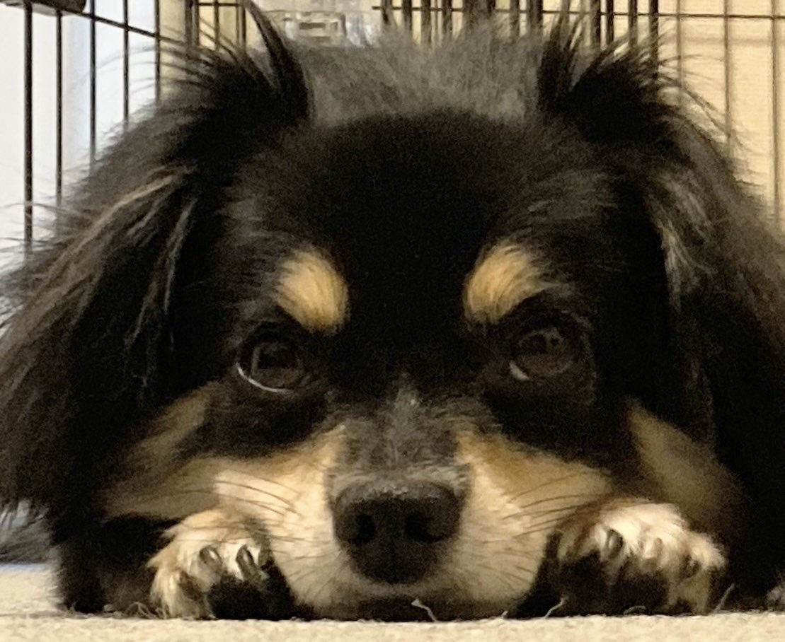
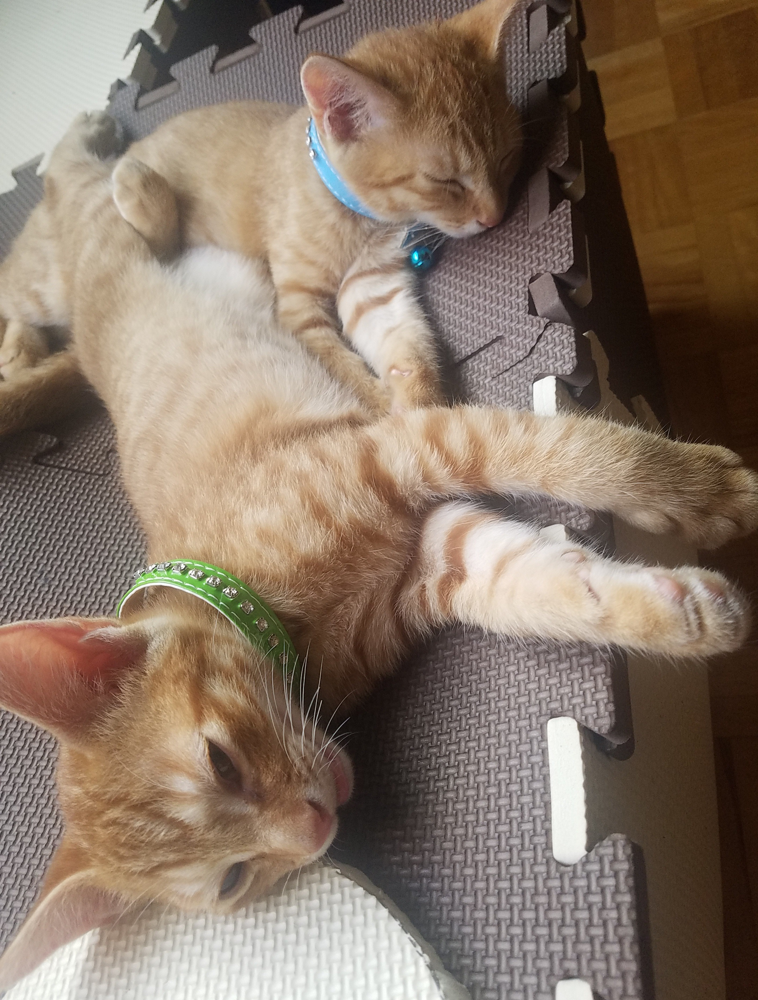

# 企画・実行委員長

    
    

        

            <b>親方 </b>
            <a href="https://twitter.com/oyakata2438">X@otakata2438</a>
        

        

            サークル名：親方Project
        

    

ワンストップ本シリーズ企画・編集（一部執筆）してます。コミケと技術書典に出没。ついに技術書同人誌博覧会（技書博）のコアスタッフとして運営側に参加。技術書イベントが増えて嬉しいけれど、イベント多すぎて外出チケットと徳が不足気味。徳を貯めるべく、家事をこなしつつ、ラボに遊びに行ったり、飲み会や懇親会で著者を新規開拓したり。著者募集はいつでもやっていますので、ぜひご参加ください。

# コアスタッフ

    
    

        

            <b>耳たぶ </b>
            <a href="https://x.com/tabuer6">X@tabuer6</a>
        

    

開発をやってみたり、テストの自動化をしてみたり、探り探りで模索中のエンジニア 
使いやすいもの、便利なもの、触っていて心地の良いソフトウェアが好き。業務内の些細な面倒を改善するツールを作って広めるのが趣味。 
楽しそうな人が好きなので、楽しそうにアウトプットをして行きたい！

 

    
    

        

            <b>いまい </b>    
		

    

できることから精一杯頑張ります！

    
    

        

            <b>FORTE(フォルテ)</b>
            <a href="https://twitter.com/FORTEgp05">Twitter@FORTEgp05</a>
        

        

            サークル名：aozora Project
        

    

Webアプリケーションのバックエンドエンジニアですが、いろいろやってます。Twitter、ブログ、Podcast配信、数多くの趣味と楽しく活動中。

    
    

        

            <b>FUMIYA（ふみや）</b>
        

    

前職は鉄道会社、現在はIT業界で日々奔走中。
「後悔のない人生」を目標に、迷ったらまず動くことを心がけています。
人に恵まれて育ってきたので、人とのつながりを大切にしています。
北海道出身。趣味は旅行・映画・読書。
