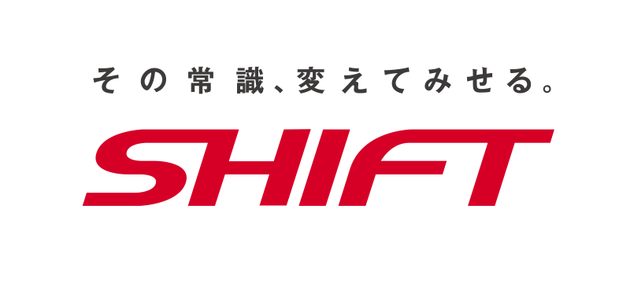
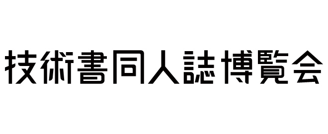
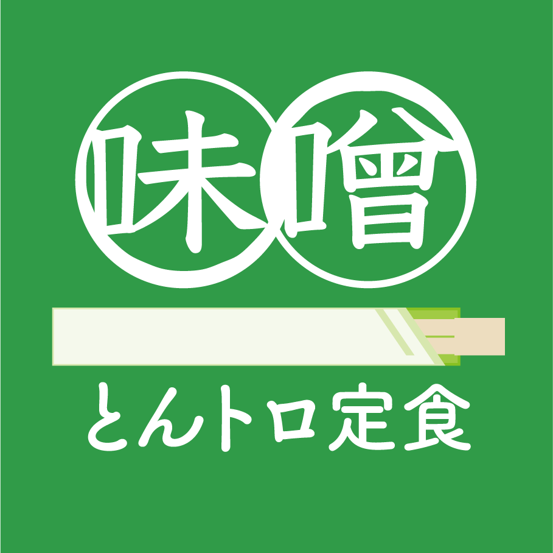

# スポンサー

## 会場スポンサー

**株式会社SHIFT**

{width=80%}

https://www.shiftinc.jp/

SHIFTは、ソフトウェアの品質保証・テストで培ったナレッジを活かし、DXの上流から下流までをカバーするソリューションの開発・提供を進めてきました。国内企業における品質とビジネスアジリティの両立を目指し、300名を超えるアジャイル人材が多様な業界を支援しています。

## サポーター/個人スポンサー

**技術書同人誌博覧会**

{width=40%}

https://gishohaku.dev/

技術書同人誌博覧会（技書博）は、技術に関する同人誌の即売会です。ITの他に、理工/数学/デザイン/マネジメントなど幅広い技術を取り扱っています。エンジニアのアウトプットを応援したい＆増やしたいという思いからこのイベントが生まれました。初心者にもベテランにも優しく、ゆったりと交流しながら知識を深め、仲間を作ったり成長できるような場所を目指しています。 

**世迷言ラボ**

{width=40%}

https://kouno-log.pages.dev/

世迷言ラボは代表のこうのが、プログラミングと設計についての技術書を作成しています。
こうのは自らの技術書執筆、地域コミュニティの運営、カンファレンスのコアスタッフなどを通し、
幅広いエンジニアのアウトプットを応援しています。

## サークル

**親方Project**

{width=40%}

https://oyakata.booth.pm/

親方Projectは、本カンファレンスの実行委員長であるおやかたが主宰するサークルです。エンジニアの困ったを解決するテーマを合同誌として発行しています。見積もりやバックアップ、学び、技術同人誌の作り方、などをテーマとした合同誌で、寄稿者は常に募集しています。ぜひご連絡ください。

また、親方Projectが出してきた同人誌を底本として商業出版もしています。

https://www.amazon.co.jp/stores/author/B07FLMHLSY

**モウフカブール**

{width=40%}

https://mofukabur.com

小笠原種高と大澤文孝を中心とした創作集団。写真集や技術書を出している。

 

 

 

**味噌とんトロ定食**

{width=40%}

https://techbookfest.org/organization/33040002

ひとこと紹介：AIやIoTなど、いま流行りの面白そうな技術で「何か」を作ってワイワイするサークルです。